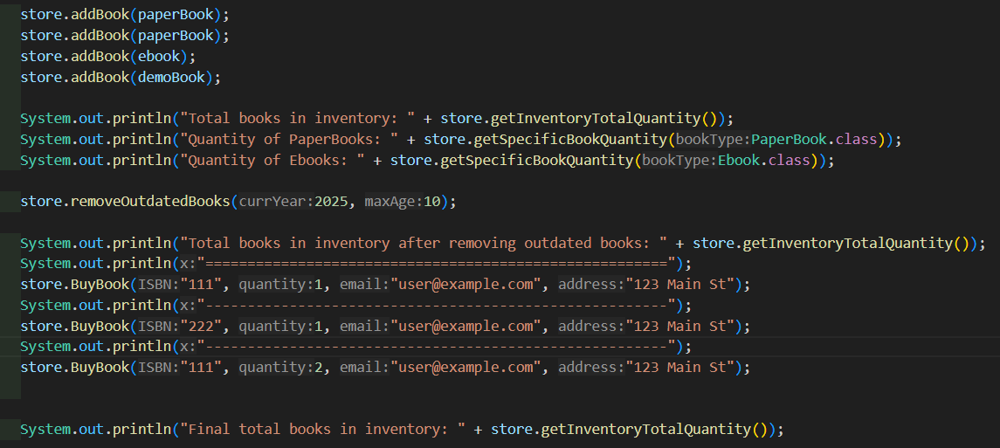
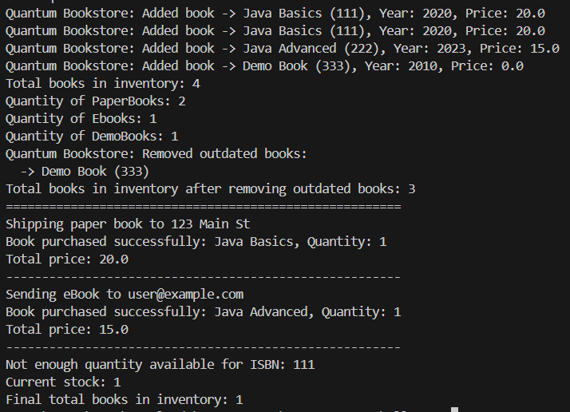
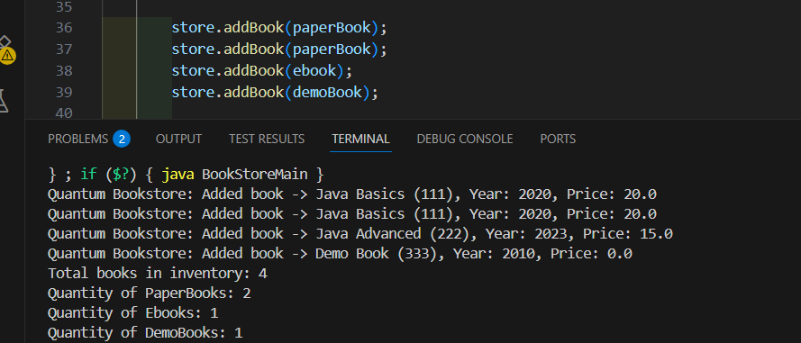
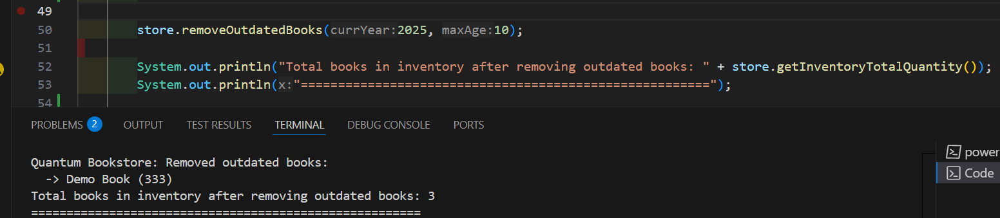
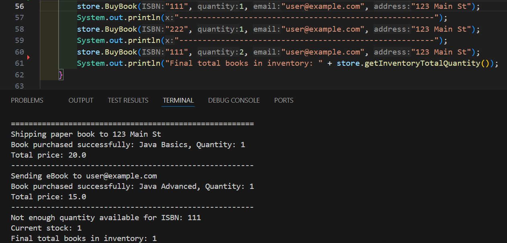

# Quantum-Bookstore-Fawry

Simple Java project for managing an online bookstore.

## Features
- Add books to inventory
- Remove outdated books
- Buy books (reduces quantity and calls services)

## Book Types
- **PaperBook** – shipped to address
- **Ebook** – sent via email
- **DemoBook** – not for sale

## How to Run
Run `BookStoreMain.java` to test:
- Adding books
- Removing outdated books
- Buying books

---

## 🖼️ Overview

## 🖥️ Sample Output

---
### Full run code:

---
---
### Full run result:

---

## ✅ Add Books

- Adds a book with details like ISBN, title, year, and price.

**Code:**

**Output:**

(Example output shown in image)

---

## 🗑️ Remove Outdated Books

- Removes books older than a specific age.
- Prints removed books’ details.

**Code:**

**Output:**

(Example output shown in image)

---

## 💳 Buy Books

- Buys a book using ISBN, quantity, email, and address.
- Reduces inventory quantity.
- Sends eBook via MailService or ships paper book via ShippingService.
- Rejects buying demo books.

**Code:**

**Output:**

(Example output shown in image)

